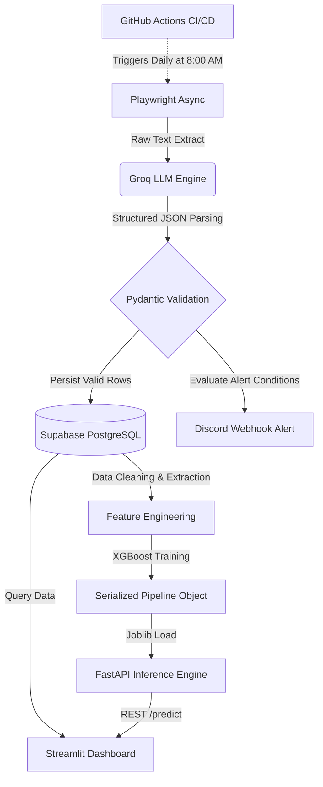

# 🏡 AI-Powered Real Estate Extraction & ML Pipeline

<div align="center">


*A live snapshot of the Streamlit analytics and interactive XGBoost price estimator, natively built on top of our daily extracted web data.*

[](https://www.python.org/)
[](https://fastapi.tiangolo.com/)
[](https://streamlit.io/)
[](https://supabase.com/)

</div>

## 📌 Executive Summary (What's this all about?)
This project is an advanced, end-to-end data engineering and machine learning pipeline built to track the real estate market without breaking a sweat. It completely bypasses brittle HTML/DOM parsers. Instead, it leverages Large Language Models (LLMs) to natively comprehend unstructured webpage text. It securely extracts daily apartment rental data from real estate domains, validates the schema, and persists the data to a remote Supabase PostgreSQL database.

But extraction is just the start. The project incorporates automated data cleaning, engineered features, and an XGBoost regression model trained to estimate fair market rental values. This intelligence is served via a high-performance FastAPI inference engine and consumed securely by an interactive Streamlit frontend for real-time analytics.

---

## 🏗 System Architecture & Data Flow



## 🚀 How it Works

### 1. Web Automation (Playwright)
- Deploys a headless Chromium browser running with anti-bot stealth configurations.
- Intelligently bypasses cookie consent banners, handles pagination dynamically, and forces lazy-loaded elements to render by programmatically scrolling.

### 2. Semantic Extraction (LLM via Groq)
- Cleans and isolates the relevant textual payload of the webpage without needing fragile CSS selectors.
- Feeds the text into the Groq API, returning validated JSON mimicking structured intelligence.

### 3. Data Validation & Persistence (Pydantic & Supabase)
- Strictly enforces schema parameters to ensure correct typing.
- Replaces local persistence with a centralized Supabase PostgreSQL connection layer using asyncpg for fast, conflict-aware algorithmic inserts.

### 4. Data Engineering & Machine Learning (XGBoost)
- Automatically handles missing values and filters extreme statistical outliers using Interquartile Range (IQR) filtering.
- Implements Target Encoding for high-cardinality categorical variables.
- Fits an XGBoost Decision Tree algorithm via randomized grid search to capture non-linear pricing patterns, serializing the resulting pipeline to disk.

### 5. Inference Backend (FastAPI)
- Exposes a high-performance REST API utilizing FastAPI lifecycle events to initialize the XGBoost model into persistent memory exactly once.
- Validates inbound prediction requests using Pydantic, instantly returning calculated estimations to client applications.

### 6. Analytics Visualizer (Streamlit)
- Connects securely to the Supabase instance to generate a responsive UI offering real-time KPIs and rent distributions by neighborhood.
- Integrates an interactive "AI Rent Estimator" allowing users to cross-reference an asking price against the FastAPI backend, easily classifying deals as Overpriced, Fair, or Great Deals.

### 7. CI/CD Automations (GitHub Actions & Webhooks)
- Scraped apartments are evaluated against business rules, triggering asynchronous requests to send formatted markdown alerts to Discord.
- The repository utilizes GitHub Actions to provision a virtual machine, inject encrypted secrets, and autonomously trigger the complete data extraction routine daily.

---

## 📁 Repository Structure

```text
.
├── .github/workflows/       # CI/CD (GitHub Actions for the daily scraper job)
├── assets/                  # UI images and serialized ML models (model.joblib)
├── data/                    # Extracted CSVs, profiling reports, and SQL logs 
├── scripts/                 # Utility scripts (e.g., Supabase seeders)
├── src/                     # Core application source code (FastAPI, Streamlit, etc.)
├── requirements.txt         # Project dependencies
└── README.md                # You are here!
```

---

## 🧠 What I Learned
Working on this project was deeply rewarding and packed with practical challenges:
- **DOM Parsers are incredibly fragile**: Relying on HTML structures is a losing game when websites update UI constantly. Switching to LLM-based semantic extraction felt like a massive paradigm shift.
- **Handling Data Drift & Chaos**: Real estate listings are inherently messy. Integrating Pydantic to strictly type and validate incoming data saved the database from becoming a dumpster fire.
- **Cloud Connections at Scale**: Migrating to a cloud DB (Supabase) meant handling connection pooling (`PgBouncer`) properly for async tasks to stop exhausting database limits. A fun and necessary learning curve!

---

## 🛠 Prerequisites

- Python 3.12+
- Supabase Account (Remote PostgreSQL configuration)
- Discord Server (For Webhook integration)
- Groq API Key

## 💻 Local Quickstart

```bash
# 1. Clone the repository
git clone https://github.com/BenniKensei/TM_rents_extraction_agent.git
cd TM_rents_extraction_agent

# 2. Setup virtual environment & activate
python -m venv venv
.\venv\Scripts\activate

# 3. Install packages & browser automation binaries
pip install -r requirements.txt
playwright install chromium

# 4. Configure .env with the following keys
GROQ_API_KEY="your_api_key"
DISCORD_WEBHOOK_URL="your_webhook"
DATABASE_URL="postgresql://postgres:[password]@[URL].pooler.supabase.com:6543/postgres"

# 5. (Optional) Seed database with historical data
python scripts/upload_backup.py

# 6. Run Pipelines
python src/agent.py
python src/model_training.py

# 7. Launch Backend Inference Server
python -m uvicorn src.api:app --reload

# 8. Launch Analytics Dashboard (in a separate terminal)
python -m streamlit run src/dashboard.py
```
