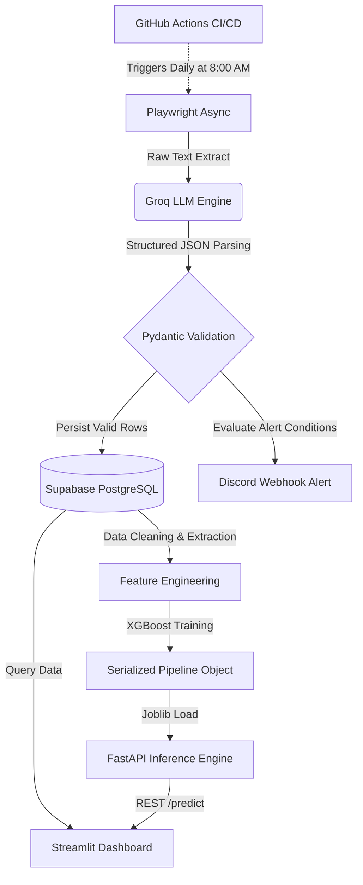

# AI-Powered Real Estate Web Extraction & Machine Learning Pipeline

<div align="center">


*A live snapshot of the Streamlit analytics and interactive XGBoost price estimator generated dynamically from extracted web data.*

</div>

## Executive Summary
This project represents an advanced, end-to-end data engineering and applied machine learning pipeline. It moves beyond brittle HTML/DOM parsers by leveraging Large Language Models (LLMs) to semantically comprehend and structure unstructured webpage text. It securely extracts daily apartment rental data from real estate domains, validates the schema, and persists the data to a remote cloud database. 

Beyond extraction, the pipeline incorporates automated data cleaning, engineered features, and trains an XGBoost regression model to estimate fair market rental values. This intelligence is served via a high-performance FastAPI inference engine and consumed seamlessly by an interactive Streamlit frontend, providing end-users with real-time analytics and valuation thresholds.

## System Architecture & Data Flow



### 1. Web Automation (Playwright)
- Deploys a headless Chromium browser running with anti-bot stealth configurations.
- Intelligently bypasses cookie consent banners, handles pagination dynamically, and forces lazy-loaded elements to render by programmatically scrolling.

### 2. Semantic Extraction (LLM via Groq)
- Cleans and isolates the relevant textual payload of the webpage text without needing fragile CSS selectors.
- Feeds the text into the Groq API, returning validated JSON mimicking structured intelligence.

### 3. Data Validation & Persistence (Pydantic & Supabase)
- Strictly enforces schema parameters ensuring correct typing natively.
- Replaces local persistence with a centralized Supabase PostgreSQL connection layer using asyncpg for fast, conflict-aware algorithmic inserts.

### 4. Data Engineering & Machine Learning (XGBoost)
- Programmatically handles missing values and filters extreme statistical outliers using Interquartile Range (IQR) filtering.
- Implements Target Encoding for high-cardinality categorical variables and synthesizes derived features like price-per-room.
- Fits an XGBoost Decision Tree algorithm via randomized grid search to capture non-linear pricing patterns, serializing the resulting pipeline to disk.

### 5. Inference Backend (FastAPI)
- Exposes a high-performance REST API utilizing FastAPI lifecycle events to initialize the XGBoost model into persistent memory exactly once.
- Validates inbound prediction requests using Pydantic, instantly returning calculated estimations to client applications.

### 6. Analytics Visualizer (Streamlit)
- Connects securely to the Supabase instance to generate a responsive UI offering real-time KPIs and rent distributions by neighborhood.
- Integrates an interactive "AI Rent Estimator" allowing users to cross-reference an asking price against the FastAPI backend, receiving classification alerts (e.g., Overpriced, Great Deal) based on a 10% algorithmic threshold.

### 7. CI/CD Automations (GitHub Actions & Webhooks)
- Scraped apartments are evaluated against business rules, triggering asynchronous aiohttp requests to send formatted markdown alerts to Discord.
- The repository utilizes GitHub Actions to provision a virtual machine, inject encrypted secrets, and autonomously trigger the entire data extraction routine daily at 8:00 AM UTC.

## Prerequisites

- Python 3.12+
- Supabase Account (Remote PostgreSQL configuration)
- Discord Server (For Webhook integration)
- Groq API Key

## Local Quickstart

```bash
# 1. Clone the repository
git clone https://github.com/BenniKensei/TM_rents_extraction_agent.git
cd TM_rents_extraction_agent

# 2. Setup virtual environment & activate
python -m venv venv
.\venv\Scripts\activate

# 3. Install packages & browser automation binaries
pip install playwright pydantic groq python-dotenv asyncpg aiohttp streamlit psycopg2-binary
pip install fastapi[standard] uvicorn xgboost scikit-learn category_encoders joblib requests
playwright install chromium

# 4. Configure .env with the following keys
GROQ_API_KEY="your_api_key"
DISCORD_WEBHOOK_URL="your_webhook"
DATABASE_URL="postgresql://postgres:[password]@[URL].pooler.supabase.com:6543/postgres"

# 5. (Optional) Seed database with historical data
python upload_backup.py

# 6. Run Pipelines
python src/agent.py
python src/model_training.py

# 7. Launch Backend Inference Server
python -m uvicorn src.api:app --reload

# 8. Launch Analytics Dashboard (in a separate terminal)
python -m streamlit run src/dashboard.py
```
