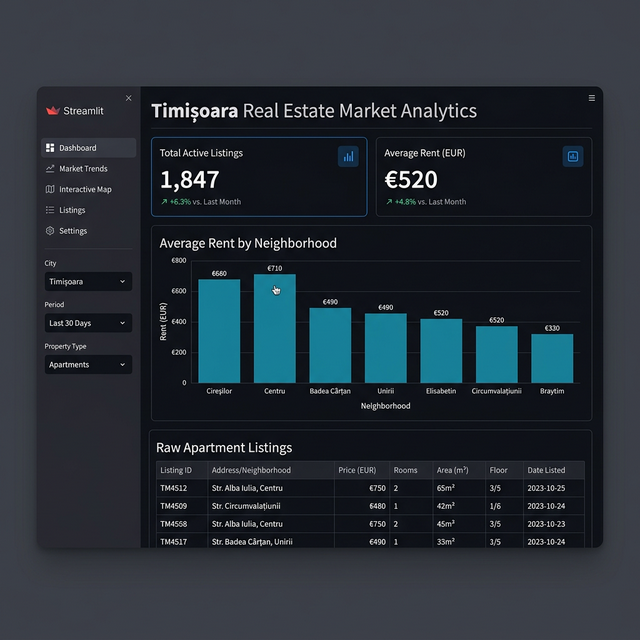
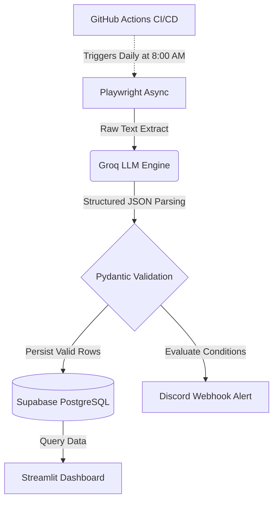

# 🏢 AI-Powered Real Estate Web Extraction Pipeline

<div align="center">


*A live snapshot of the Streamlit analytics generated dynamically from extracted web data.*

</div>

## 📌 Executive Summary
This project represents an advanced, end-to-end data engineering and automation pipeline. Rather than writing brittle HTML/DOM parsers using BeautifulSoup that break with every website update, this agent leverages Large Language Models (LLMs) to semantically comprehend and structure unstructured webpage text. It securely extracts daily apartment rental data from real estate domains, validates the schema, persists the data to a remote cloud database, surfaces analytics to a frontend dashboard, and dispatches automated event-driven alerts.

## 🚀 System Architecture & Data Flow



### 1. Web Automation (Playwright)
- Deploys a headless Chromium browser running with anti-bot stealth configurations.
- Intelligently bypasses cookie consent banners, handles pagination dynamically, and forces lazy-loaded elements to render by programmatically scrolling.

### 2. Semantic Extraction (LLM via Groq)
- Cleans and isolates the relevant textual payload of the webpage text without needing fragile CSS selectors.
- Feeds the text into the Groq API (e.g., `llama-3.1-8b-instant`), returning validated `JSON` mimicking structured intelligence.

### 3. Data Validation & Transformation (Pydantic)
- Strictly enforces schema parameters ensuring correct typing (e.g., transforming currency into EUR, mapping booleans for pet-friendliness).
- Malformed unstructured data is gracefully handled by the rigorous Pydantic models.

### 4. Cloud Database (Supabase PostgreSQL)
- Replaces local persistence with a centralized `Supabase` PostgreSQL connection layer.
- Uses `asyncpg` within Python for incredibly fast algorithmic inserts while avoiding duplicates via an `ON CONFLICT` constraints update logic.

### 5. Automated Alerting (Discord Webhooks)
- Scraped apartments are evaluated against business rules (e.g., `Price <= €350` and `Neighborhood == Complexul Studentesc`).
- Hits matching criteria trigger ultra-fast `aiohttp` asynchronous requests sending formatted markdown messages to a live Discord channel.

### 6. Analytics Visualizer (Streamlit)
- Connects securely to the Supabase instance using `psycopg2` via environment variables.
- Rapidly generates an interactive UI offering real-time KPIs, interactive tables, and high-level rent distributions by neighborhood.

### 7. CI/CD Pipeline (GitHub Actions)
- The entire application runs autonomously without human intervention.
- The `.github/workflows` automation provisions a virtual machine, injects encrypted Repository Secrets into the environment, runs the pipeline at `8:00 AM UTC` daily, and updates all databases and webhooks seamlessly.

## 🛠 Prerequisites

- Python 3.12+
- Supabase Account (Remote PostgreSQL configuration)
- Discord Server (For Webhook integration)
- Groq API Key

## 💻 Local Quickstart

```bash
# 1. Clone the repository
git clone https://github.com/BenniKensei/TM_rents_extraction_agent.git
cd TM_rents_extraction_agent

# 2. Setup virtual environment & activate
python -m venv venv
.\venv\Scripts\activate

# 3. Install packages & browser automation binaries
pip install playwright pydantic groq python-dotenv asyncpg aiohttp streamlit psycopg2-binary
playwright install chromium

# 4. Configure .env with the following keys
GROQ_API_KEY="your_api_key"
DISCORD_WEBHOOK_URL="your_webhook"
DATABASE_URL="postgresql://postgres:[password]@[URL].pooler.supabase.com:6543/postgres"

# 5. Run Scraper Pipeline
python agent.py

# 6. Launch Analytics Dashboard
streamlit run dashboard.py
```
